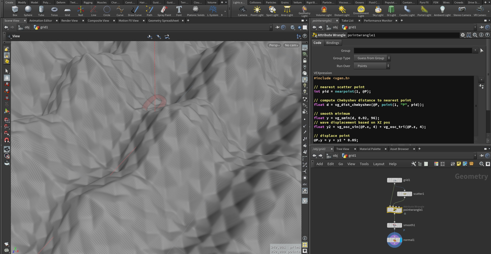

# vexed-generation

A collection of common utilities and functions for maths, geometry
generation & processing in [SideFX Houdini
VEX](https://www.sidefx.com/docs/houdini/vex/) (incl. some OpenCL). Most
of these were created when I started using Houdini in earnest in early
2016, but have proven themselves useful ever since and extend the
built-in VEX arsenal. Some operations (e.g. Marching squares, Parallel
Transport Frames, Disjoint Set etc.) were ported from some of my Clojure
libraries.

## Installation

```bash
git clone https://github.com/thi-ng/vexed-generation.git
```

Add the following variables to your `houdini.env` file (replacing
`<absulute-path-to-vexed-generation>` with the location of where you
cloned this repo on your drive), then start Houdini:

```
HOUDINI_VEX_PATH = <absulute-path-to-vexed-generation>/vex;&;
HOUDINI_OCL_PATH = <absulute-path-to-vexed-generation>/opencl;&;
```

See here for more details about the [`houdini.env` file](https://www.sidefx.com/docs/houdini/basics/config_env.html).

## Usage

Vexed generation functions can be used in any suitable VEX context (SOP,
SHOP etc.). Simply include `vgen.h` into your VEX source code / wrangle
snippet. See [/vex](vex/) for available functions.

All functions, types/structs in this library are prefixed with `vg_`.

### Example



1. Create a new "Grid" and configure it to:
    - ZX plane
    - size 1x1
    - rows / cols 500 x 500
2. Attach a "Scatter" node, set point count to 500, relax iterations to 20
3. Attach a "Point Wrangle" using the "Grid" as first input and "Scatter" as 2nd input:

```c
#include <vgen.h>

// nearest scatter point
int pid = nearpoint(1, @P);

// compute Chebyshev distance to nearest point
float d = vg_dist_chebyshev(@P, point(1, "P", pid));

// smooth minimum
float y = vg_smin(d, 0.02, 96);
// wave displacement based on XZ pos
float y2 = vg_osc_sin(@P.x, 4) + vg_osc_tri(@P.z, 4);

// displace point
@P.y = y + y2 * 0.05;
```

